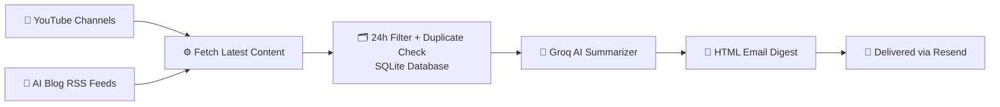

# 📰 AI News Agent

A fully automated news digest agent that fetches the latest videos from YouTube channels and articles from AI blogs, summarizes them using AI, and delivers a clean daily email — every morning, automatically.

Built with Python, Groq AI, Resend, and GitHub Actions.


---

## ✨ Features

- 🎥 **YouTube fetcher** — pulls latest videos from any YouTube channel via RSS
- 📰 **RSS fetcher** — pulls articles from AI blogs (Anthropic, OpenAI, DeepMind, Wired, and more)
- ⏰ **24-hour filter** — only sends content published in the last 24 hours, never old news
- 🗄️ **SQLite database** — remembers sent items so you never receive duplicates
- 🤖 **AI summaries** — uses Groq (free) to rewrite messy descriptions into clean 2-sentence summaries
- 📧 **HTML email digest** — beautifully formatted newsletter delivered to your inbox
- ⚙️ **Fully automated** — runs every day via GitHub Actions, no manual effort needed

---

## 📸 How It Works



## 🚀 Getting Started

### 1. Clone the repo

```bash
git clone https://github.com/YOUR_USERNAME/ai-news-agent.git
cd ai-news-agent
```

### 2. Create a virtual environment

```bash
python -m venv venv
venv\Scripts\activate       # Windows
source venv/bin/activate    # Mac/Linux
```

### 3. Install dependencies

```bash
pip install requests feedparser python-dotenv resend groq
```

### 4. Set up your `.env` file

Create a `.env` file in the root folder:

```env
RESEND_API_KEY=re_xxxxxxxxxxxxxxxx
TO_EMAIL=youremail@gmail.com
GROQ_API_KEY=gsk_xxxxxxxxxxxxxxxx
```

### 5. Get your API keys

| Service | Where to get it | Cost |
|---|---|---|
| **Resend** | [resend.com](https://resend.com) → API Keys | Free (100 emails/day) |
| **Groq** | [console.groq.com/keys](https://console.groq.com/keys) | Free (1000 req/day) |

### 6. Run it locally

```bash
python src/main.py
```

---

## ⚙️ Configuration

### Add your YouTube channels

Edit `src/youtube.py`:

```python
CHANNELS = [
    {"name": "Fireship",     "id": "UCsBjURrPoezykLs9EqgamOA"},
    {"name": "AI Explained", "id": "UCNJ1Ymd5yFuUPtn21xtRbbw"},
    # add more here
]
```

To find a channel ID, go to their YouTube page and look at the URL, or use [commentpicker.com/youtube-channel-id.php](https://commentpicker.com/youtube-channel-id.php).

### Add your RSS feeds

Edit `src/rss_fetcher.py`:

```python
RSS_FEEDS = [
    {"name": "Anthropic Blog",    "url": "https://www.anthropic.com/rss.xml"},
    {"name": "OpenAI Blog",       "url": "https://openai.com/blog/rss.xml"},
    {"name": "Google DeepMind",   "url": "https://deepmind.google/blog/rss.xml"},
    {"name": "Wired AI",          "url": "https://www.wired.com/feed/tag/ai/latest/rss"},
    {"name": "Hugging Face Blog", "url": "https://huggingface.co/blog/feed.xml"},
    # add more here
]
```

### Change the schedule

Edit `.github/workflows/daily.yml`:

```yaml
- cron: '0 7 * * *'   # every day at 7:00 AM UTC
```

Use [crontab.guru](https://crontab.guru) to customize the time.

---

## 🤖 Automating with GitHub Actions

### 1. Push your code to GitHub

```bash
git add .
git commit -m "initial commit"
git push
```

### 2. Add secrets to GitHub

Go to your repo → **Settings** → **Secrets and variables** → **Actions** → **New repository secret**

Add these three secrets:

| Name | Value |
|---|---|
| `RESEND_API_KEY` | your Resend API key |
| `TO_EMAIL` | your email address |
| `GROQ_API_KEY` | your Groq API key |

### 3. Test it manually

Go to **Actions** tab → **Daily News Digest** → **Run workflow** → **Run workflow**

Your agent will run in the cloud and send you an email within 60 seconds.

---

## 📦 Dependencies

| Package | Purpose |
|---|---|
| `feedparser` | Parse YouTube and blog RSS feeds |
| `groq` | AI summaries via Groq API |
| `resend` | Send HTML emails |
| `python-dotenv` | Load secrets from `.env` file |
| `requests` | HTTP requests |

---

## 🔮 Planned Features

- [ ] Keyword filter — only receive news about topics you care about
- [ ] Weekly digest — best-of-the-week summary every Sunday
- [ ] Telegram notifications — instant ping for breaking news
- [ ] AI content ranker — score and sort stories by importance

---

## 🙏 Acknowledgements

Inspired by the [datalumina/ai-news-aggregator](https://github.com/datalumina/ai-news-aggregator) project.

---

## 📄 License

MIT License — feel free to use, modify, and share.